# GitLab Issues Automated Tracker - Setup & Run Guide

## What do you need? 

#### Basics and SignUps  

- https://docs.gitlab.com/user/get_started  
- https://dashboard.cohere.com/welcome/login

#### Gitlab Access Token 
https://docs.gitlab.com/user/profile/personal_access_tokens  

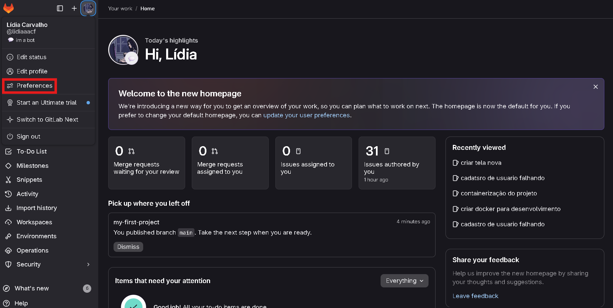  
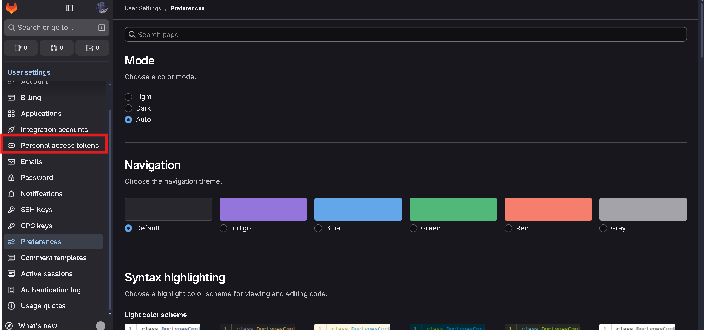  
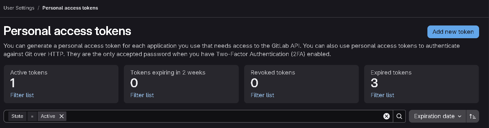  
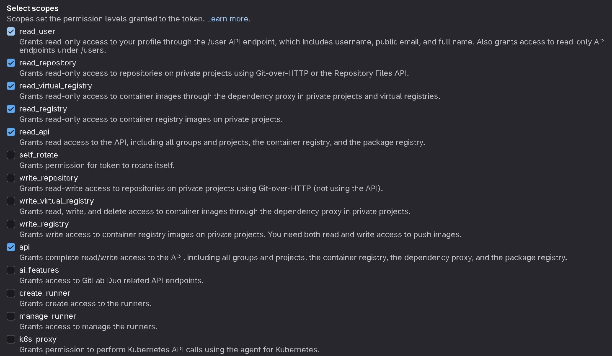  
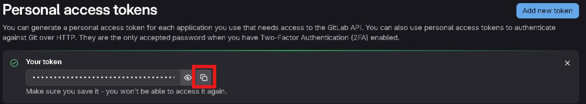  

#### Gitlab Project ID  

##### First project
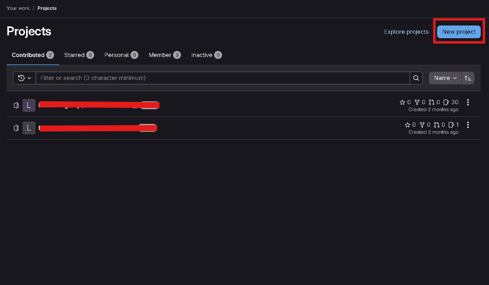  
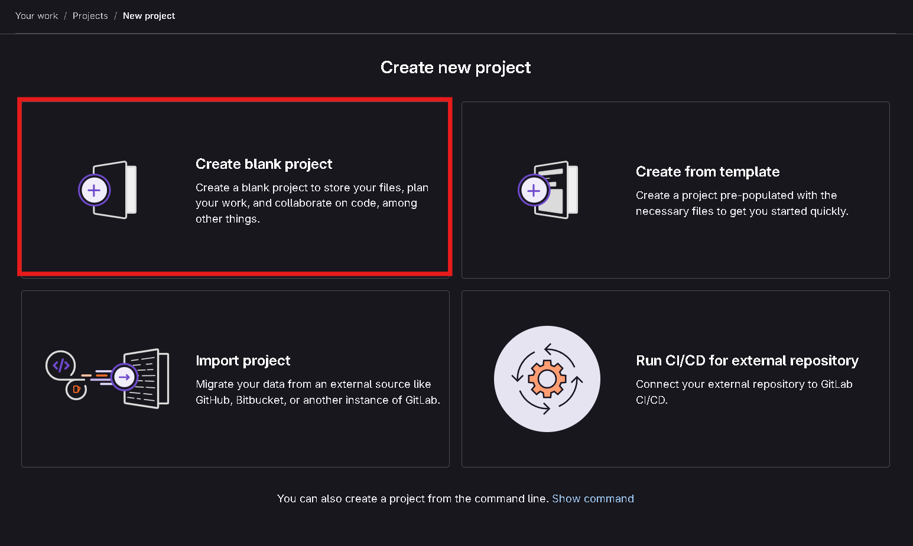   
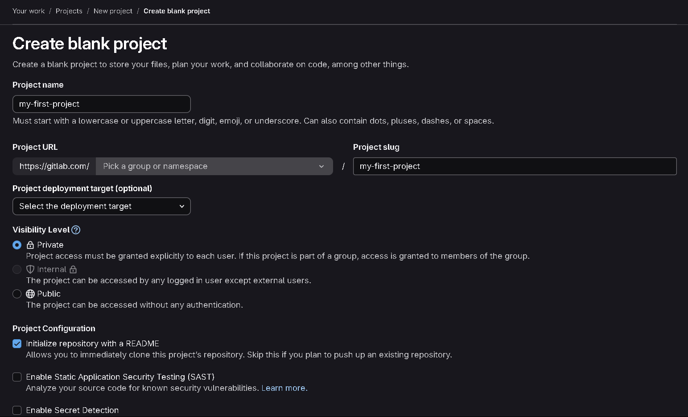  
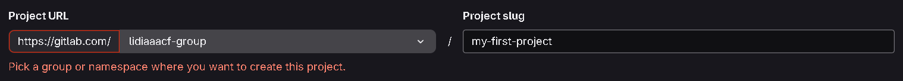  
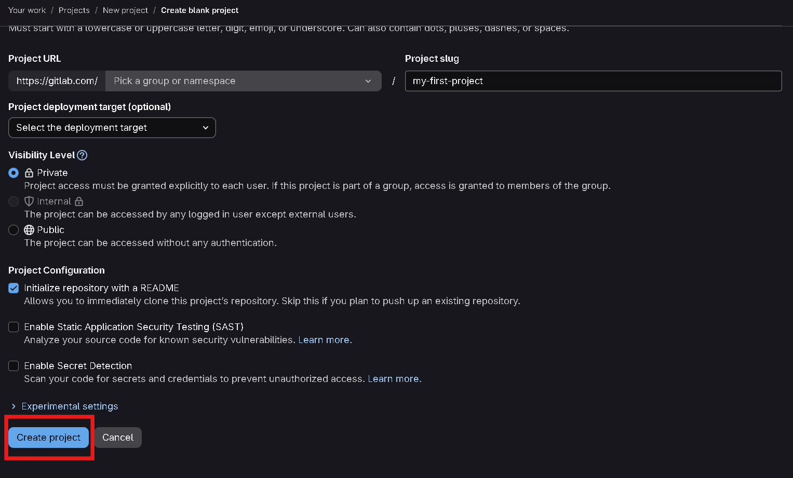  
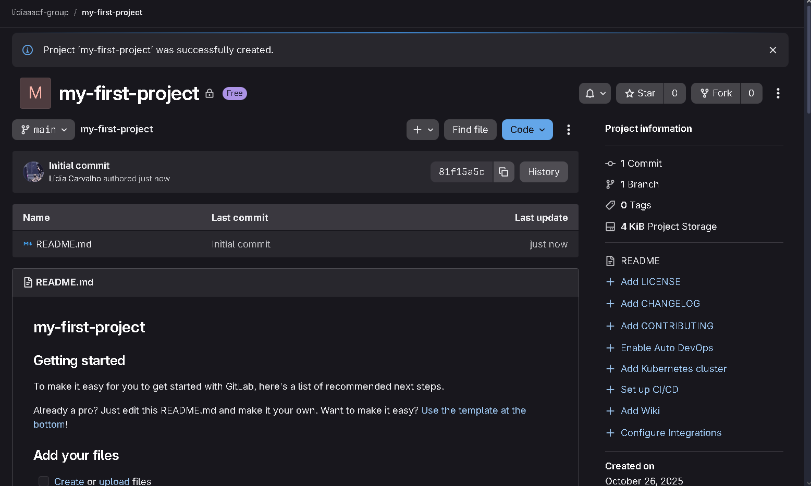  
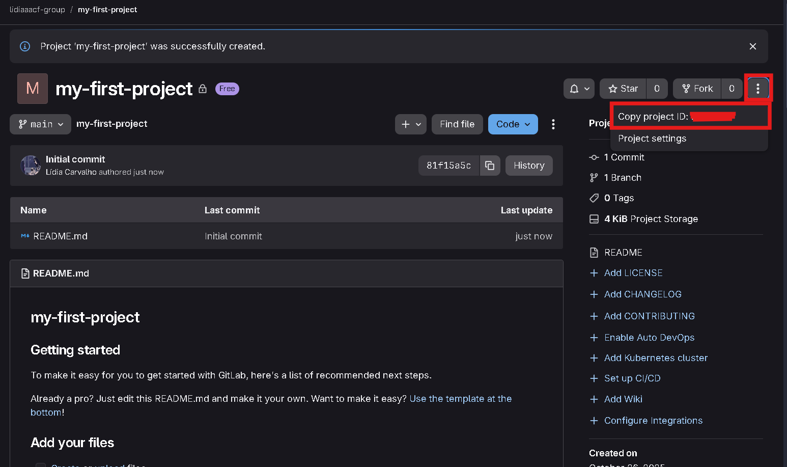  

##### Project already created   
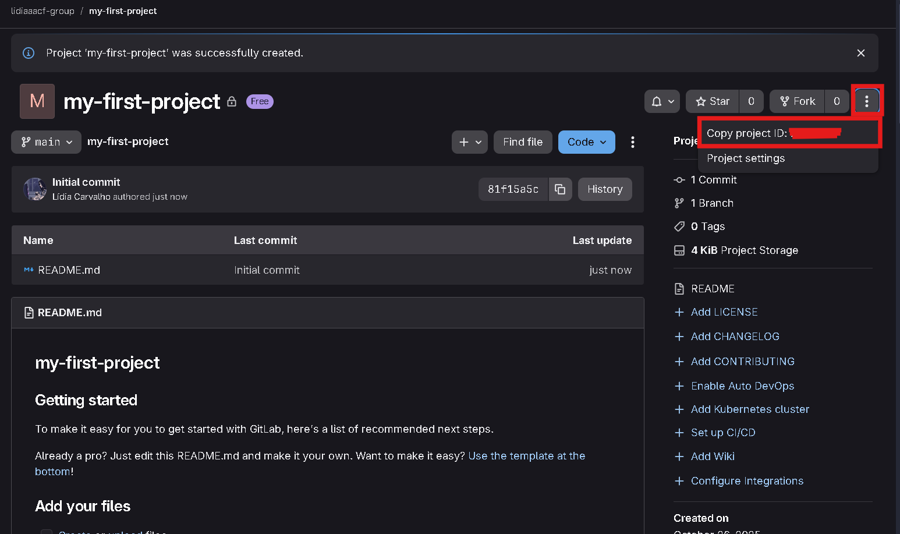  
 
#### Cohere API 

- Sign-Up /Sign-In  
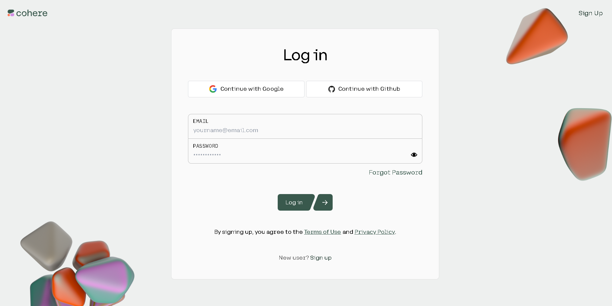  
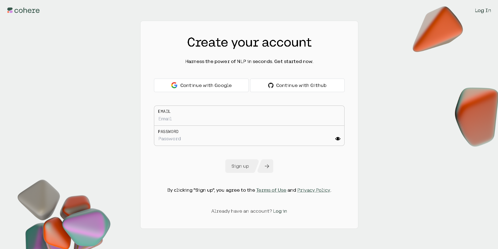  

- Navigate to API Keys  
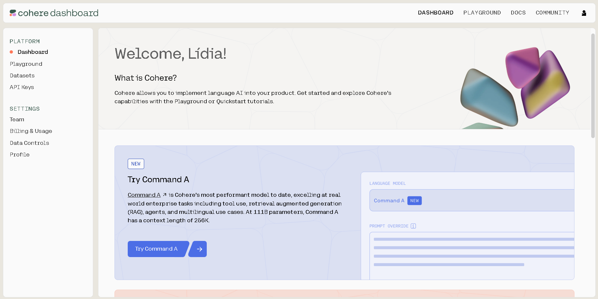  
  

- Create a new Trial Key  
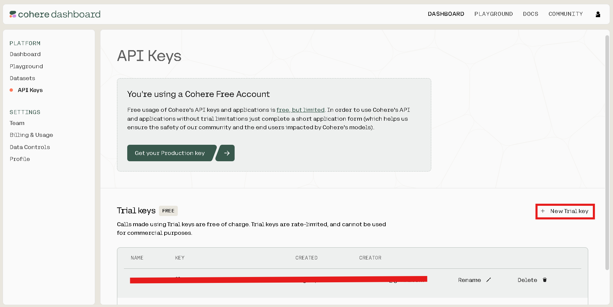  
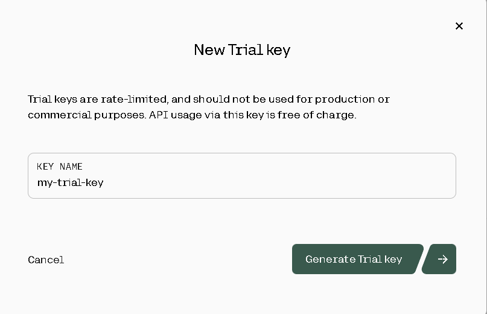  
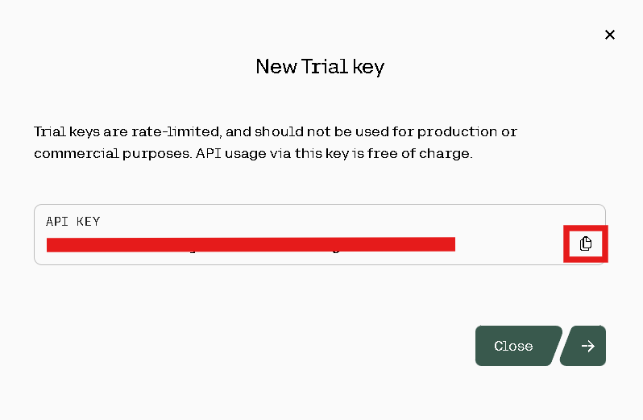  

## Clone Repository

```bash
git clone https://github.com/lidiaaacf/card-creator-automation.git  
cd card-creator-automation  
```

## Environment Variables

Create a `.env` file inside the `src/frontend` folder with the following variables:

```
VITE_ISSUES_DB='http://localhost:8080'
VITE_ISSUES_GITLAB='http://localhost:8080/get-automation-issues'
VITE_PROJETOS_GITLAB='http://localhost:8080/get-projects/'
VITE_CRIA_ISSUE='http://localhost:8080/create-issue'
```

Create a `.env` file inside the `src/backend` folder with the following variables:

```
GITLAB_URL=https://gitlab.com
GITLAB_TOKEN=<your_gitlab_access_token>
GITLAB_PROJECT_ID=<your_gitlab_project_id>
COHERE_API_KEY=<your_cohere_trial_key>
LOCAL_FRONT='http://localhost:5173'
LOCAL_BACK='http://localhost:8080'
DATABASE_URL = "sqlite:///./app.db"
```

## Installing dependencies and running the application
Open two terminals for better management

#### Backend
```bash
cd src/backend

python -m venv venv 

venv\Scripts\activate

pip install -r requirements.txt

```

#### Frontend
```bash
cd src/frontend

npm install

```

## Running the application
Open two terminals for better management 

#### Backend
The routes will be visible (and callable) at `http://localhost:8080`.
```bash
cd src/backend

venv\Scripts\activate

python -m uvicorn main:app --reload --port 8080

```

#### Frontend
The app will be available at `http://localhost:5173`.
```bash
cd src/frontend

npm run dev
```

## Usage

* Select a GitLab project from the dropdown.
* View issues in the table with filtering by search or date range.
* Use the dashboard to see summary statistics.
* Create new issues using the modal form, enhanced optionally with AI suggestions.
* Reset filters with the "Clear" button next to the search input.

## Notes

* Date range filters dynamically update the table and dashboard.
* The dashboard calculates totals, percentages, and averages based on filtered issues.
* Closing and reopening the app resets the date filters.

## Build for Production

```bash
npm run build
```

or

```bash
yarn build
```

The production-ready files will be in the `dist` folder.
