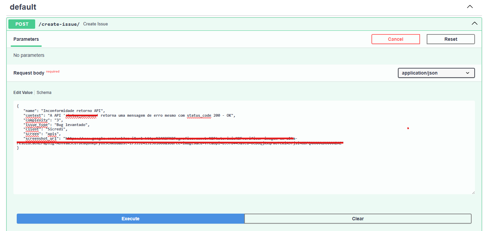
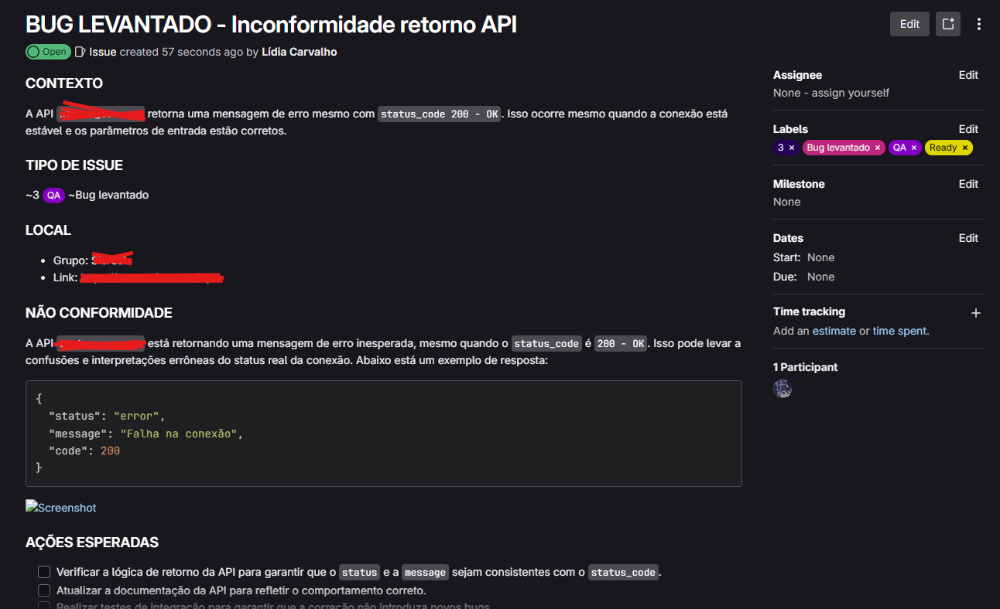

## Home  
  

## New Issue  

- Título: name of the issue
- Inconformidade: quick description of the problem  
- Select the weight (complexity): 1, 2, 3, 5, 8, 13
- Select the type: Feature, New develop, Bug levantado, Bug reportado, Ajuste, Teste
   
  

Click "Enviar para Gitlab" to create issue, "Cancelar" to cancel.

After some seconds you'll see:  

  

Then on Gitlab:  

  
  

## Search  
  

## Clear  
  

## Switch between projects  
  

## Dashboard  

#### Without filtered date  
  

#### With filtered date  
  
  

## Favorite issues  
  

## See details 
  